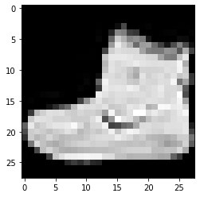
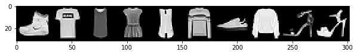

```python
import torch
import torchvision
import torchvision.transforms as transforms
```


```python
train_set = torchvision.datasets.FashionMNIST(
    root = './data/FashionMNIST'#where to retrieve data from
    ,train = True #make it training data
    ,download = True #if not available, download
    ,transform=transforms.Compose([ #make it a tensor
        transforms.ToTensor()
    ])
)
train_loader = torch.utils.data.DataLoader( #wrap train_set in DataLoader instance
    train_set, batch_size=10
)
```


```python
import numpy as np
import matplotlib.pyplot as plt

torch.set_printoptions(linewidth=120)
```


```python
len(train_set)
```


    60000


```python
train_set.train_labels #each number represents a fashion mnist item
```

    C:\Users\jbits\Anaconda3\lib\site-packages\torchvision\datasets\mnist.py:43: UserWarning: train_labels has been renamed targets
      warnings.warn("train_labels has been renamed targets")
    


    tensor([9, 0, 0,  ..., 3, 0, 5])


```python
train_set.train_labels.bincount() #10 itesm each with 6000 appereances (balanced data set)
```


    tensor([6000, 6000, 6000, 6000, 6000, 6000, 6000, 6000, 6000, 6000])


*In a unbalanced data set, oversampling the least common class to the most common class is always the right thing to do*

#### Retrieving a single sample


```python
sample = next(iter(train_set)) #retreiving a single sampple from the train_set
```


```python
len(sample)
```


    2


We see that when retrieving one single sample, the size is 2. This is because samples are tobles of two elements (image, label)


```python
type(sample)
```


    tuple


```python
image, label = sample #sequence unpacking, instead of indexing sample[0] and sample[1] 
```


```python
image.shape
```


    torch.Size([1, 28, 28])


```python
print(label)
```

    9
    


```python
plt.imshow(image.squeeze(), cmap ='gray')
print('label: ', label)
```

    label:  9
    





```python
batch = next(iter(train_loader))
```


```python
len(batch)
```


    2


```python
type(batch) #notice the difference between the type of train_loader sample and train_set sample
```


    list


```python
images, labels = batch
```


```python
images.shape #since we picked our batch to be 10, we have a 4 dimesional tensor with 1 color
             #channel with 28 by 28 images
```


    torch.Size([10, 1, 28, 28])


```python
labels.shape #10 labels for the 10 imags in the batch
```


    torch.Size([10])


```python
grid = torchvision.utils.make_grid(images, nrow = 10) #nrow specifies the number of items per row

plt.figure(figsize=(10,10)) #size of the figures
plt.imshow(np.transpose(grid, (1,2,0)))

print('labels: ', labels)
```

    labels:  tensor([9, 0, 0, 3, 0, 2, 7, 2, 5, 5])
    





```python

```
