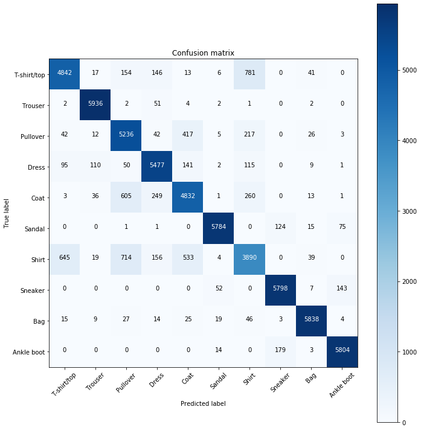

### CNN Training Loop 

We now understand how to train a single batch. Now we want to train epochs, which means training all the batches of a data set. The number of batches of a data set can be determined by `(batch_size)/(data_size)`. In our case, using Fashion MNIST (60k images) and a batch size of 100 means 600 batches will constitute an epoch.


```python
import torch
import torch.nn as nn
import torch.nn.functional as F
import torch.optim as optim

import torchvision
import torchvision.transforms as transforms

torch.set_printoptions(linewidth = 120)
torch.set_grad_enabled(True) #already enabled by default
```


    <torch.autograd.grad_mode.set_grad_enabled at 0x20d829d8d30>


```python
train_set = torchvision.datasets.FashionMNIST(
    train = True
    ,download = True
    ,root = './data'
    ,transform = transforms.Compose([
        transforms.ToTensor()
    ])
)
```


```python
def get_num_correct(preds, labels):
    return preds.argmax(dim=1).eq(labels).sum().item()
```


```python
class Network(nn.Module):
    def __init__(self):
        super(Network,self).__init__()
        
        self.conv1 = nn.Conv2d(in_channels = 1, out_channels = 6, kernel_size = 5)
        self.conv2 = nn.Conv2d(in_channels = 6, out_channels = 12, kernel_size = 5)
        
        self.fc1 = nn.Linear(in_features = 12*4*4, out_features = 120)
        self.fc2 = nn.Linear(in_features = 120, out_features = 60)
        self.out = nn.Linear(in_features = 60, out_features = 10)
        
    def forward(self, t):
        t = F.relu(self.conv1(t))
        t = F.max_pool2d(t,kernel_size = 2, stride = 2)
        
        t = F.relu(self.conv2(t))
        t = F.max_pool2d(t,kernel_size = 2, stride = 2)
        
        t = F.relu(self.fc1(t.reshape(-1,12*4*4))) #flattening the tensor
        t = F.relu(self.fc2(t))
        t = self.out(t) 
        
        return t
```


```python
network = Network()

train_loader = torch.utils.data.DataLoader(train_set, batch_size = 100, shuffle = True)
optimizer = optim.Adam(network.parameters(), lr = 0.01)

for epoch in range(5): #specify how many epochs we want to train
    total_loss = 0
    total_correct = 0

    for batch in train_loader: #loop over number of batches in the train loader
        images, labels = batch

        preds = network(images) #pass batch
        loss = F.cross_entropy(preds,labels) #calculate loss

        optimizer.zero_grad() #have to clear gradients since the function backward accumulates gradients
        loss.backward() #update weights
        optimizer.step()

        total_loss += loss.item()
        total_correct += get_num_correct(preds, labels)

    print("epoch:", epoch, "total_correct:", total_correct, "loss,", total_loss)
        
```

    epoch: 0 total_correct: 47502 loss, 330.0529633164406
    epoch: 1 total_correct: 51664 loss, 224.6580277532339
    epoch: 2 total_correct: 52318 loss, 207.20625719428062
    epoch: 3 total_correct: 52561 loss, 199.24289163202047
    epoch: 4 total_correct: 52976 loss, 190.33430439978838
    


```python
total_correct/len(train_set) #calculating accuracy
```


    0.8829333333333333


#### Testing net with a single image 


```python
image, label = next(iter(train_set))
```


```python
image.shape
```


    torch.Size([1, 28, 28])


```python
image.unsqueeze(0).shape # we need a batch to pass to the network
```


    torch.Size([1, 1, 28, 28])


```python
pred = network(image.unsqueeze(0))
```


```python
pred.argmax() #our net believes the label is 9, lets check if its corect
```


    tensor(9)


```python
label #and it is corect! :)
```


    9


### Analyzing CNN Results: Building and Plotting Confusion Matrix

Now we want a visual way to to see our results and see where our network is doing good or bad. This can be done using a confusion matrix.


```python
len(train_set)
```


    60000


```python
len(train_set.targets)
```


    60000


#### Getting predictions for the whole training set 


```python
def get_all_preds(model, loader):
    all_preds = torch.tensor([]) #tensor to hold all predictions
    for batch in loader:
        images, labels = batch
        
        preds = model(images)
        all_preds = torch.cat((all_preds,preds),dim = 0) #cat all_preds with preds of batch
        
    return all_preds 
```


```python
preditction_loader = torch.utils.data.DataLoader(train_set, batch_size = 10000)
```


```python
train_preds = get_all_preds(network, preditction_loader)
```


```python
train_preds.shape #60000 predictions, each consits of the probability of each item
```


    torch.Size([60000, 10])


```python
print(train_preds.requires_grad) #this is on, but we dont need gradient tracking since we are not training 
#and we are not doing (back propagation)
```

    True
    


```python
train_preds.grad #we dont get a gradient value untill we call backwards() function
```


```python
train_preds.grad_fn #graph is being tracked, but we don't need this extra overhead
```


    <CatBackward at 0x20d829d8048>


```python
with torch.no_grad(): #turn off grad tracking (faster!)
    preditction_loader = torch.utils.data.DataLoader(train_set, batch_size = 10000)
    train_preds = get_all_preds(network, preditction_loader)
```


```python
print(train_preds.requires_grad)
```

    False
    


```python
train_preds.grad_fn
```


```python
preds_correct = get_num_correct(train_preds, train_set.targets)

print('total correct:', preds_correct)
print('accuracy: ', preds_correct/len(train_set))
```

    total correct: 53437
    accuracy:  0.8906166666666666
    

#### Building the Confusion Matrix


```python
train_set.targets #labels
```


    tensor([9, 0, 0,  ..., 3, 0, 5])


```python
train_preds.argmax(dim= 1) #predictions
```


    tensor([9, 0, 0,  ..., 3, 0, 5])


```python
stacked = torch.stack(
    (
        train_set.targets
        ,train_preds.argmax(dim =1)
    )
    , dim =1
)
```


```python
stacked.shape #tensor consisting of pairs of predicted labels and true labels
```


    torch.Size([60000, 2])


```python
stacked
```


    tensor([[9, 9],
            [0, 0],
            [0, 0],
            ...,
            [3, 3],
            [0, 0],
            [5, 5]])


```python
stacked[0].tolist()
```


    [9, 9]


```python
j,k = stacked[0].tolist() #unpacking list
```


```python
j
```


    9


```python
k
```


    9


```python
cmt = torch.zeros(10,10, dtype =torch.int32)
cmt #confusing matrix tensor
```


    tensor([[0, 0, 0, 0, 0, 0, 0, 0, 0, 0],
            [0, 0, 0, 0, 0, 0, 0, 0, 0, 0],
            [0, 0, 0, 0, 0, 0, 0, 0, 0, 0],
            [0, 0, 0, 0, 0, 0, 0, 0, 0, 0],
            [0, 0, 0, 0, 0, 0, 0, 0, 0, 0],
            [0, 0, 0, 0, 0, 0, 0, 0, 0, 0],
            [0, 0, 0, 0, 0, 0, 0, 0, 0, 0],
            [0, 0, 0, 0, 0, 0, 0, 0, 0, 0],
            [0, 0, 0, 0, 0, 0, 0, 0, 0, 0],
            [0, 0, 0, 0, 0, 0, 0, 0, 0, 0]], dtype=torch.int32)


```python
for p in stacked:
    j,k = p.tolist() #unpack the two elements of the list
    cmt[j,k] = cmt[j,k] + 1 #find the corresponding index and increment by 1
```


```python
cmt
```


    tensor([[4842,   17,  154,  146,   13,    6,  781,    0,   41,    0],
            [   2, 5936,    2,   51,    4,    2,    1,    0,    2,    0],
            [  42,   12, 5236,   42,  417,    5,  217,    0,   26,    3],
            [  95,  110,   50, 5477,  141,    2,  115,    0,    9,    1],
            [   3,   36,  605,  249, 4832,    1,  260,    0,   13,    1],
            [   0,    0,    1,    1,    0, 5784,    0,  124,   15,   75],
            [ 645,   19,  714,  156,  533,    4, 3890,    0,   39,    0],
            [   0,    0,    0,    0,    0,   52,    0, 5798,    7,  143],
            [  15,    9,   27,   14,   25,   19,   46,    3, 5838,    4],
            [   0,    0,    0,    0,    0,   14,    0,  179,    3, 5804]], dtype=torch.int32)


#### Plotting Confusion Matrix


```python
import matplotlib.pyplot as plt

from sklearn.metrics import confusion_matrix
```


```python
import itertools
import numpy as np
import matplotlib.pyplot as plt

def plot_confusion_matrix(cm, classes, normalize=False, title='Confusion matrix', cmap=plt.cm.Blues):
    if normalize:
        cm = cm.astype('float') / cm.sum(axis=1)[:, np.newaxis]
        print("Normalized confusion matrix")
    else:
        print('Confusion matrix, without normalization')

    print(cm)
    plt.imshow(cm, interpolation='nearest', cmap=cmap)
    plt.title(title)
    plt.colorbar()
    tick_marks = np.arange(len(classes))
    plt.xticks(tick_marks, classes, rotation=45)
    plt.yticks(tick_marks, classes)

    fmt = '.2f' if normalize else 'd'
    thresh = cm.max() / 2.
    for i, j in itertools.product(range(cm.shape[0]), range(cm.shape[1])):
        plt.text(j, i, format(cm[i, j], fmt), horizontalalignment="center", color="white" if cm[i, j] > thresh else "black")

    plt.tight_layout()
    plt.ylabel('True label')
    plt.xlabel('Predicted label')
```


```python
cm = confusion_matrix(train_set.targets, train_preds.argmax(dim=1))
print(type(cm))
cm
```

    <class 'numpy.ndarray'>
    


    array([[4842,   17,  154,  146,   13,    6,  781,    0,   41,    0],
           [   2, 5936,    2,   51,    4,    2,    1,    0,    2,    0],
           [  42,   12, 5236,   42,  417,    5,  217,    0,   26,    3],
           [  95,  110,   50, 5477,  141,    2,  115,    0,    9,    1],
           [   3,   36,  605,  249, 4832,    1,  260,    0,   13,    1],
           [   0,    0,    1,    1,    0, 5784,    0,  124,   15,   75],
           [ 645,   19,  714,  156,  533,    4, 3890,    0,   39,    0],
           [   0,    0,    0,    0,    0,   52,    0, 5798,    7,  143],
           [  15,    9,   27,   14,   25,   19,   46,    3, 5838,    4],
           [   0,    0,    0,    0,    0,   14,    0,  179,    3, 5804]],
          dtype=int64)


```python
names = ('T-shirt/top','Trouser','Pullover','Dress','Coat','Sandal','Shirt','Sneaker','Bag','Ankle boot')
plt.figure(figsize = (10,10))
plot_confusion_matrix(cm, names)
```

    Confusion matrix, without normalization
    [[4842   17  154  146   13    6  781    0   41    0]
     [   2 5936    2   51    4    2    1    0    2    0]
     [  42   12 5236   42  417    5  217    0   26    3]
     [  95  110   50 5477  141    2  115    0    9    1]
     [   3   36  605  249 4832    1  260    0   13    1]
     [   0    0    1    1    0 5784    0  124   15   75]
     [ 645   19  714  156  533    4 3890    0   39    0]
     [   0    0    0    0    0   52    0 5798    7  143]
     [  15    9   27   14   25   19   46    3 5838    4]
     [   0    0    0    0    0   14    0  179    3 5804]]
    





```python

```
